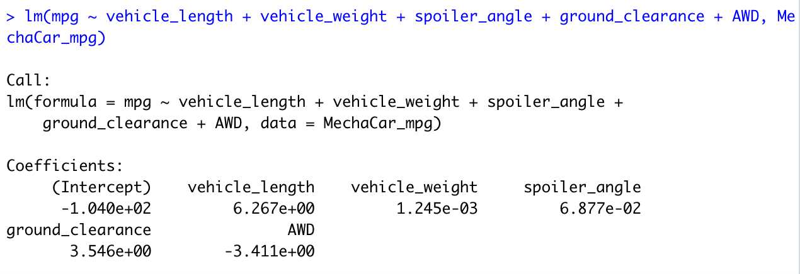

# MechaCar_Statistical_Analysis

## Linear Regression to Predict MPG
Coefficients:
  

  Summary:
  

By looking at the linear regression result created based on MGP, the intercept, vehicle.length, and ground.clearance have provided a non-random amount of variance. The reason for that is the Pr(>|t|) values, and the three values all have a significance code of 0. Also, the vehicle.length and ground.clearance have a significant impact on the MPG.
As shown in the image—Summary, the p-value of this model is 5.35e-11 that is way smaller than the assumed significance level of 0.05%. Therefore, the slope of this model cannot be considered to be zero. Also, we can state that there is sufficient evident to reject our null hypothesis. 
Yes, this linear model predicts MPG of MechaCar prototypes effectively because of the r-squared value. The r-squared value is 0.7149, which means that about 71% of all MPG predictions would be correct when using this model.

## Summary Statistics on Suspension Coils
  Total Summary:
  
  Lot Summary:
  
  Looking at all four variances that we calculated, only Lot3 has a variance of 220.01 that exceeds the 100 pounds per square inch and the rest variances are below the specified value. Therefore, the current manufacturing data does meet this design specification for all manufacturing lots in total, Lot1, and Lot2. Only Lot3 does not meet this specification.

## T-Test on Suspension Coils
  One Sample T-Test:
  
  Lot1 T-Test:
  
  Lot1 T-Test:
  
  Lot1 T-Test:
  
By looking at the p-value resulted from the one sample T-Test, the p-value is 0.5117. Assuming the significance level of 0.05%, the p-value is way above our significance level so that  this data is considered to have normal distribution. Therefore, there is not enough evidence to reject the null hypothesis.  
Lot1 T-Test’s p-value is 0.9048, which is above the significance level of 0.05%. So that we do not reject the null hypothesis.
Lot2 T-Test’s p-value is 0.3451, which is above the significance level of 0.05%So that we do not reject the null hypothesis.
Lot3 T-Test’s p-value is 0.637, which is above the significance level of 0.05%So that we do not reject the null hypothesis.
All 4 T-Tests have given the result that we do not have enough evidence to reject the null hypothesis, which means the PSI for each manufacturing lot is similar to the mean of 1,500 pounds per square inch.

## Study Design: MechaCar vs Competition
When people decide to buy a car, what occurs most in their mind? Cost? Fuel efficiency? Horse power? For me, I would say color! Color options is one of the most important roles for customers in car selection. The most common colors we see on road are black, white, and silver. Also, bright and outstanding colors for convertible cars and sports coupe cars. Also, some colors stand out for their brand. The question to ask would be which color or colors are the most popular with customers.  I would use ANOVA test to see the distribution means of the different color options since ANOVA test can compare three or more unpatched groups. Also, I would use Chi-square test to perform the comparison of color options between all various colors, because Chi-square test is designed to compare one group to a hypothetical value. We would need to gather the purchasing data of various color options of MechaCars. After we conduct the result from both tests, we can conclude  what color or colors are the most popular for cars, and whether car color can influence customers’ purchasing habit. 